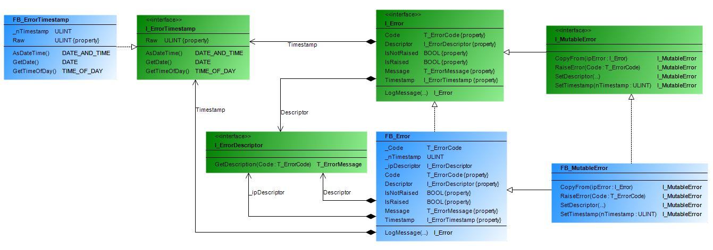

# FisoThemes' Error Library for TwinCAT

## Overview
An error handling library for TwinCAT that provides a structured way to manage and log errors in your applications.

## Features
- Define and manage error codes and messages.
- Log errors with timestamps and descriptors.
- Create custom error descriptors and loggers.
- Easily integrate with existing TwinCAT applications.

## Dependencies

FsError depends on the following libraries:
- **[FsCommon](https://github.com/fisothemes/FisoThemes-Common-Library-for-TwinCAT) :** Provides common data structures and utilities.

## Class Diagram
### Error

### Error Descriptor

### Error Logger

### Error Timestamp


## Usage
### Creating an Error
To create an error, use the `FsError.F_CreateError(...)` function. This function requires an error descriptor and an error code. It returns a new `FsError.T_Error` instance containing the specified error information with a timestamp of when it was created.

```js
METHOD DoSomething
VAR_INPUT
    ipObject : I_Object;
END_VAR
VAR_OUTPUT
    bIsBusy : BOOL; // Is the operation still executing?
    Error   : FsError.T_Error;  // Error produced by operation.
END_VAR

// Check if interface is valid and raise an error if it's not.
IF ipObject = 0 THEN
    Error := FsError.F_CreateError(
        FsError.GVL_ErrorDescriptors.fbGeneralErrorCodes,
        FsError.E_GeneralErrorCode.ERR_INVALID_INTERFACE);
    RETURN;
    END_IF

...

END_METHOD
```

### Logging an Error
To log an error, use the `LogMessage(...)` method of the `FsError.T_Error` instance. This method takes an error logger. The error can be logged using different loggers, such as the provided ADS logger (`FB_AdsErrorLogger`) and a disk logger (`FB_DiskErrorLogger`) or a custom logger implemented using the `FsError.I_ErrorLogger` interface.
```js
PROGRAM MAIN
VAR
    bCreateError,
    bLogWithAds,
    bLogToDisk      : BOOL;
    dErrDate        : DATE;
    todErrTime      : TOD;
    Err             : FsError.T_Error;
    fbWithAdsLogger : FsError.FB_AdsErrorLogger;
    fbToDisk        : FsError.FB_DiskErrorLogger('C:\temp\errlog.csv');
END_VAR

// Create error.
IF bCreateError THEN 
    bCreateError := FALSE;
    Err := FsError.F_CreateError(
        GVL_ErrorDescriptors.fbAdsReturnCodes,
        E_AdsReturnCode.ADSERR_DEVICE_EXISTS);
    END_IF

// Log error with ADS logger.
IF bLogWithAds THEN
    Err.LogMessage(fbWithAdsLogger, bIsBusy => bLogWithAds);
    END_IF

// Log error to disk.
IF bLogToDisk THEN
    Err.LogMessage(fbToDisk, bIsBusy => bLogToDisk);
    END_IF

// Get date of error.
dErrDate    := Err.Timestamp.GetDate();

// Get time of day of error.
todErrTime  := Err.Timestamp.GetTimeOfDay();

...

END_PROGRAM
```

### Creating Custom Error Descriptors

To create a custom error descriptor, implement the I_ErrorDescriptor interface in a function block. If the function block has no input and output parameters in its main body, it is recommended to add the `{attribute 'no_explicit_call':= 'direct call for this function block is not allowed'}` pragma. Additionally, the `{attribute 'no_assign'}` pragma is highly advised to maintain immutability, preventing the compiler from complaining about extracting the interface from a function block declared as a constant.

```js
// Descriptor for Custom errors codes.
// Provides description for errors.
{attribute 'no_assign'}
{attribute 'enable_dynamic_creation'}
{attribute 'no_explicit_call' := 'direct call for this function block is not allowed'}
FUNCTION_BLOCK FINAL FB_CustomCodesDescriptor IMPLEMENTS FsError.I_ErrorDescriptor
VAR
END_VAR

...

// Retrieves the descriptive message for the specified error code.
METHOD GetDescription : FsError.T_ErrorMessage // The descriptive message corresponding to the provided error code.
VAR_INPUT
    Code : FsError.T_ErrorCode; // The error code for which the description is to be retrieved.
END_VAR

CASE Code OF
    E_CustomErrorCode.ERR_NOERROR:              GetDescription := 'No error.';
    E_CustomErrorCode.ERR_CUSTOM:               GetDescription := 'Custom error.';
    E_CustomErrorCode.ERR_INDEX_OUT_OF_BOUNDS:  GetDescription := 'Index out of bounds.';
    ...
ELSE
    GetDescription := CONCAT('Unknown error code: ', CONCAT(TO_STRING(Code), '.'));
    END_CASE
END_METHOD

...

END_FUNCTION_BLOCK 
```

Next, create a GVL to hold a global instance of your descriptor. It is recommended to maintain an instance of your error descriptor for the lifetime of your application to avoid the possibility of accessing invalid references. You can use `VAR_STAT` if you need to scope the access of the error descriptor. The `{attribute 'no_assign'}` pragma ensures immutability, preventing accidental writes to the global variable and causing a compilation error if the assignment operator is used.

```js
// GVL_CustomErrorDescriptors
{attribute 'qualified_only'}
VAR_GLOBAL
    fbCustomErrorCodes : FB_CustomCodesDescriptor;
    ...
END_VAR
```

### Create a Custom Error Logger

To create a custom error logger, create a function block that implements the functional interface `FsError.I_ErrorLogger` and add implementation for the `Invoke` method.

```js
// Logs error to a buffer.
{attribute 'enable_dynamic_creation'}
{attribute 'no_explicit_call' := 'direct call for this function block is not allowed'}
FUNCTION_BLOCK FINAL FB_BufferedErrorLogger IMPLEMENTS I_ErrorLogger
VAR
    _arBuffer   : ARRAY[0..100] OF FsError.T_Error;
    _nCount     : UINT;
END_VAR
VAR CONSTANT
    _nCAPACITY  : UINT := SIZEOF(_arBuffer)/SIZEOF(_nCount);
END_VAR


// Logs the provided error message.
METHOD Invoke
VAR_INPUT
    ipError : I_Error;  // The error message to be logged.
END_VAR
VAR_OUTPUT
    bIsBusy : BOOL;     // Is the operation still executing?
    Error   : T_Error;  // Error produced by operation.
END_VAR

IF ipError = 0 THEN
    Error := F_CreateError(
        FsError.GVL_ErrorDescriptors.fbAdsReturnCodes,
        FsError.E_AdsReturnCode.ADSERR_DEVICE_INVALIDINTERFACE);
    RETURN;
    END_IF

IF ipError.IsNotRaised THEN RETURN; END_IF

THIS^.Append(ipError, Error => Error);
END_METHOD


// Appends the error to the buffer
METHOD PRIVATE Append
VAR_INPUT
    ipError     : FsError.I_Error; // The error to append
END_VAR
VAR_OUTPUT
    Error       : FsError.T_Error; // Error produced by the operation
END_VAR
VAR
    fbMutError  : FsError.FB_MutableError;
END_VAR

IF ipError = 0 THEN
    Error := F_CreateError(
        FsError.GVL_ErrorDescriptors.fbAdsReturnCodes,
        FsError.E_AdsReturnCode.ADSERR_DEVICE_INVALIDINTERFACE);
    RETURN;
    END_IF

IF _nCount < _nCAPACITY THEN
    fbMutError.CopyFrom(ipError);
    _arBuffer[_nCount] := fbTmpError; // Copy error to buffer
    _nCount := _nCount + 1;
ELSE
    // Buffer is full, handle error
    Error := FsError.F_CreateError(
        FsError.GVL_ErrorDescriptors.fbAdsReturnCodes,
        FsError.E_AdsReturnCode.ADSERR_DEVICE_NOMEMORY);
    END_IF

END_METHOD

...

END_FUNCTION_BLOCK
```

Then simply use your logger like so;

```js
VAR
    stValue         : ST_Value;
    Err             : FsError.T_Error;
    fbList          : FsCollections.FB_DynamicList(ItemSize := SIZEOF(ST_Value));
    fbToErrorBuffer : FB_BufferedErrorLogger;
END_VAR

fbList.Insert(87126, stValue, Error => Err);
IF Err.IsRaised THEN Err.LogMessage(fbToErrorBuffer); END_IF
```

### Preserving the Error

If you need to run multiple operations and prevent downstream failures from masking the root cause, use `F_PreserveError`:

```js
METHOD ExecuteRecipe : BOOL
VAR_IN_OUT
    Recipe : T_Recipe;
END_VAR
VAR_OUTPUT
    Error : T_Error;
END_VAR

// Configure dosing pump, fundamental step.
// Any error here will be preserved in `Error`.
fbDosingPump1.SetFlow(
    Flow  := Recipe.Flow,
    Error => F_PreserveError(Error)
);

// Start mixing process, retains original error context.
fbMixer.Start(
    Speed := Recipe.Speed,
    Error => F_PreserveError(Error)
);

// ... additional steps

// Result: If the pump fails, `Error` remains "Pump failed."
//       Mixer errors do not overwrite the first failure.
```

## Developer Notes
This project is still in development. There's a lot of work and testing ahead. Changes to functionality may occur in the future.

This is designed to be part of a larger framework that is still under development.

## Acknowledgment
Components of this library were inspired by [Roald87](https://github.com/Roald87)'s [TcError](https://github.com/Roald87/TcError/tree/main).